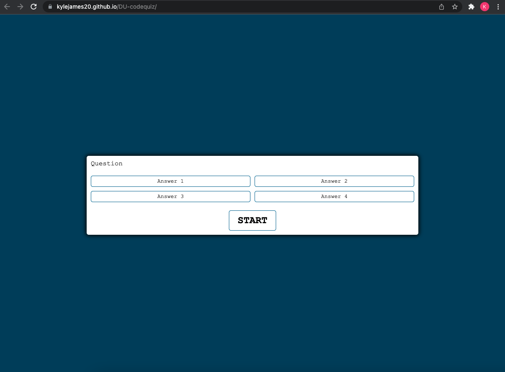

# DU-codequiz
Code Quiz Homework

This repository lets users take a quiz that contains several questions with multiple choice answers.

Allows user to select 1 of 4 answers.
Prompts user with either a correct outcome or an incorrect outcome.
Prompts user to the next question.
Once all questions have been answered, the user will be allowed to enter their initials that go with their score.

Below, find attached links to Github repository and deployed finished project.

[Live link to site](https://kylejames20.github.io/DU-codequiz/)

[Direct link to Github repository](https://github.com/kylejames20/DU-codequiz)
